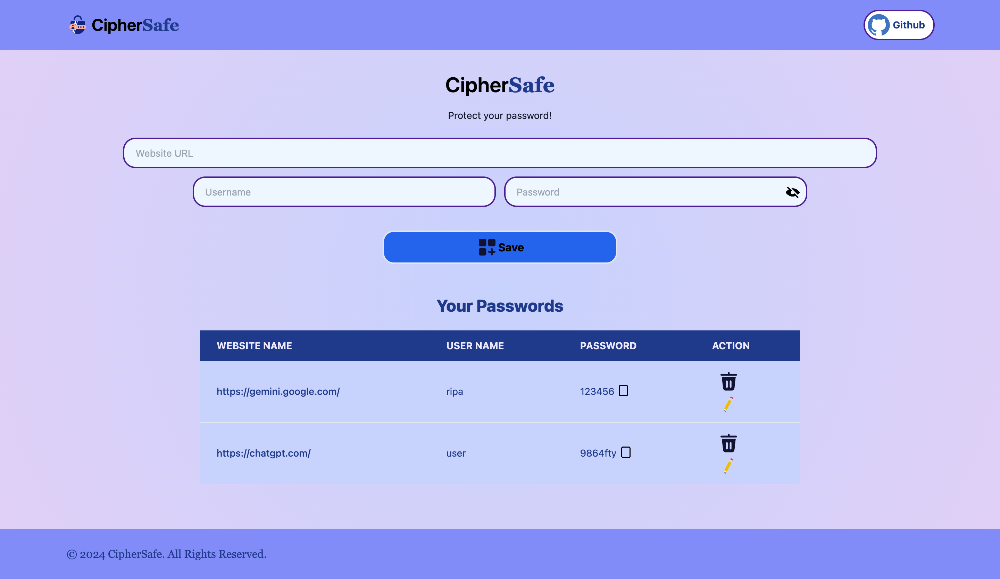

# CipherSafe

CipherSafe is a password management application built with React and Tailwind CSS. Users can manage their passwords by uploading, deleting and viewing stored credentials in a secure and user-friendly interface.

## Preview



## Technologies Used

- **Frontend**: React, Vite
- **Styling**: Tailwind CSS
- **Routing**: React Router DOM
- **Icons**: Lordicon
- **Notifications**: React Toastify
- **Unique Identifiers**: uuid

## Installation

1. **Clone the repository:**

```bash
git clone https://github.com/ripa01/CipherSafe.git
```

2. **Navigate to the project directory:**

```bash
cd CipherSafe
```

3. **Install dependencies:**

```bash
npm install
```

4. **Start the development server:**

```bash
npm run dev
```

The application will be available at `http://localhost:5173/`.
